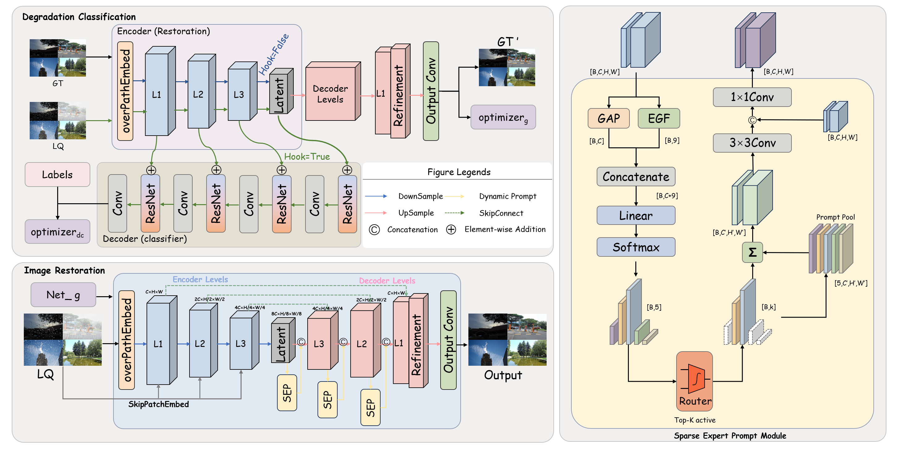

# HOGformer: All-Weather Image Restoration

A multi-weather image restoration project based on HOGformer, supporting restoration under diverse adverse weather conditions such as **snow (Snow100K)**, **raindrops (RainDrop)**, and **rain (Test1 / RainCityscapes, etc.)**. The model is fine-tuned on the Allweather dataset after DCPT pre-training.

\---

## ✨ Features

* 🌨️ Snow removal on Snow100K-S / Snow100K-L
* 💧 Raindrop removal on RainDrop
* 🌧️ Rain removal on general rain datasets
* 🚀 Fine-tuned from DCPT pre-trained weights for improved restoration quality
* 📊 Built-in PSNR / SSIM evaluation

\---

## 🖼️ Network Architecture

<p align="center">
  
</p>

The figure above shows the overall architecture of HOGformer, consisting of three main components: **Degradation Classification**, **Image Restoration**, and the **Sparse Expert Prompt Module**. Please refer to the corresponding implementation files in this repository (*update this with the actual code path, e.g. `net/model.py`*).

> A high-resolution vector version is available at `assets/Framework.pdf`.

\---

## 📁 Directory Structure

```
.
├── assets/
│   ├── Framework.png                 # Network architecture diagram
│   └── Framework.pdf                 # Network architecture diagram (vector version)
├── experiments/
│   └── finetune\_HOGformer\_Allweather\_after\_DCPT/
│       └── model/
│           └── best.pth              # Fine-tuned best-performing checkpoint
├── Allweather/
│   └── test/
│       ├── Snow100K-Test/
│       │   └── Snow100K-S/
│       │       ├── synthetic/        # Degraded snow images (input)
│       │       └── gt/               # Corresponding clean ground-truth images
│       ├── RainDrop/
│       │   └── test\_a/
│       │       ├── input/
│       │       └── gt/
│       └── Test1/
│           ├── input/
│           └── gt/
├── results/                          # Output directory for test results
├── testok.py                         # Test script
└── README.md
```

\---

## 🔧 Requirements

```bash
# It is recommended to create a conda environment
conda create -n hogformer python=3.9 -y
conda activate hogformer

# Install dependencies
pip install -r requirements.txt
```

> Please adjust the PyTorch / CUDA versions in `requirements.txt` according to your actual setup.

\---

## 📦 Dataset Preparation

This project is evaluated on the **Allweather** benchmark, which includes the following three subsets:

|Dataset|Scenario|Input Path|GT Path|
|-|-|-|-|
|Snow100K-S|Snow|`Allweather/test/Snow100K-Test/Snow100K-S/synthetic`|`Allweather/test/Snow100K-Test/Snow100K-S/gt`|
|RainDrop|Raindrop|`Allweather/test/RainDrop/test\_a/input`|`Allweather/test/RainDrop/test\_a/gt`|
|Test1|Rain|`Allweather/test/Test1/input`|`Allweather/test/Test1/gt`|

Please place the downloaded datasets according to the directory structure above, or modify the path arguments in the test commands to point to your own dataset locations.

\---

## 🏋️ Pretrained Weights

Testing this project requires **two checkpoint files**:

1. `best.pth`: the fine-tuned backbone checkpoint, passed via the `--ckpt\_path` command-line argument;
2. `net\_g\_100000.pth`: its path must be manually set in the test configuration file (`.yml`) before running.

**👉** [**Click here to download the pretrained weights**](https://pan.baidu.com/s/1ofzokXqdCX9jv4znqpRZsA?pwd=1ffb) (extraction code: `1ffb`)

After downloading, place the two checkpoint files as follows:

```
experiments/finetune\_HOGformer\_Allweather\_after\_DCPT/model/best.pth
```

Then, in the test configuration file (e.g. `options/test/xxx.yml`, *replace with the actual config path in this project*), update the corresponding field to point to `net\_g\_100000.pth`, for example:

```yaml
# options/test/xxx.yml
path:
  pretrain\_network\_g: ./experiments/pretrained/net\_g\_100000.pth   # replace with the actual field name and path
```

> ⚠️ If this weight path is not configured correctly, the test script may fail to load the model or throw an error. Please double-check this before running any tests.

\---

## 🚀 Quick Test

Use `testok.py` to test on different weather scenarios. After testing, restored images will be saved to `output\_folder`, and PSNR / SSIM metrics will be printed.

> Make sure both checkpoint files have been downloaded and configured as described in the previous section before running the commands below.

### 1\. Snow Removal (Snow100K-S)

```bash
python testok.py \\
    --ckpt\_path ./experiments/finetune\_HOGformer\_Allweather\_after\_DCPT/model/best.pth \\
    --input\_folder ./Allweather/test/Snow100K-Test/Snow100K-S/synthetic \\
    --gt\_folder ./Allweather/test/Snow100K-Test/Snow100K-S/gt \\
    --output\_folder ./results/Snow100K-S
```

### 2\. Raindrop Removal (RainDrop)

```bash
python testok.py \\
    --ckpt\_path ./experiments/finetune\_HOGformer\_Allweather\_after\_DCPT/model/best.pth \\
    --input\_folder ./Allweather/test/RainDrop/test\_a/input \\
    --gt\_folder ./Allweather/test/RainDrop/test\_a/gt \\
    --output\_folder ./results/RainDrop
```

### 3\. Rain Removal (Test1)

```bash
python testok.py \\
    --ckpt\_path ./experiments/finetune\_HOGformer\_Allweather\_after\_DCPT/model/best.pth \\
    --input\_folder ./Allweather/test/Test1/input \\
    --gt\_folder ./Allweather/test/Test1/gt \\
    --output\_folder ./results/Test1
```

### Argument Description

|Argument|Description|
|-|-|
|`--ckpt\_path`|Path to the backbone checkpoint (i.e. `best.pth`)|
|`--input\_folder`|Folder containing degraded test images|
|`--gt\_folder`|Folder containing the corresponding clean ground-truth images (used for PSNR/SSIM)|
|`--output\_folder`|Folder where restored images will be saved|

\---

## 📊 Results

|Dataset|PSNR (dB)|SSIM|
|-|-|-|
|Snow100K-S|33.02|0.9466|
|RainDrop|-|-|
|Test1|-|-|

> Update the table above with your actual test results.

\---

## 📌 Notes

1. Before running for the first time, make sure the `results/` directory exists; the script will automatically create the corresponding subfolders.
2. Checkpoint files are large — it is recommended to host them externally (see the download link above) rather than committing them directly to the GitHub repository.
3. Before testing, make sure the path to `net\_g\_100000.pth` in the configuration file is set correctly, otherwise the model may fail to load.
4. When testing on a custom dataset, make sure the filenames in the `input` and `gt` folders correspond to each other one-to-one.

